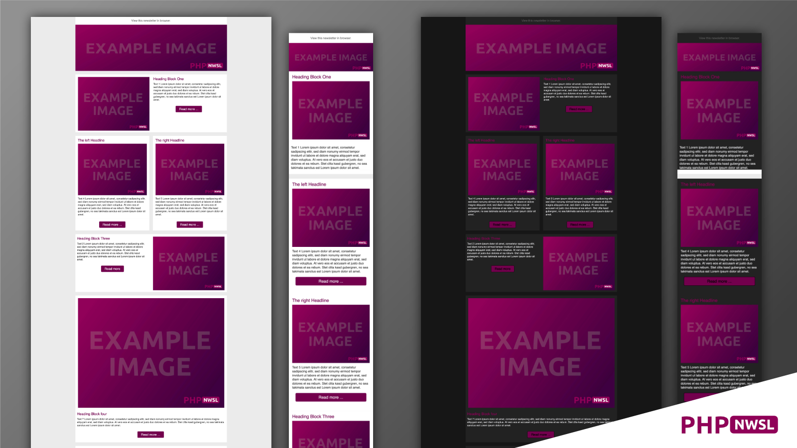

Create responsive HTML emails (Newsletters) with a few lines of PHP code. 
You don't really need to know how to program. It is very easy.
You can Copy the Code and use it for mailchimp.com or cleverrech.com for example.

## Examples

In this repository we have two examples. 
A bright ```examples/bright/``` and a dark ```examples/dark/``` Template.

## How it works

1. Copy the bright or dark example to your server.
2. Open the file `variables.php` and set your colors.
3. Add/Edit the contents.
4. Grab the code.

### 1. The example files

If you have copied an example to the server, you can access the following files in the browser:

1. `.../bright/index.php` The newsletter itself
2. `.../bright/web.php` The web-view of the newsletter without the "read in browser" sentence
3. `.../bright/code.php` A preview and the Code of your e-mail

### 2. The file variables.php

In the first part of the file you can set the colors. The variables should be self-explanatory.

* `$primary_color` is the main color. Used f.e. for headings.
* `$text_color` the color for the text
* `$btn_bg` the background color for your call to action buttons
* And so on

### 3. The contents

* `contents/preheader.txt` contains the preview text that most e-mail programs display before opening an e-mail message
* `contents/text_webview.txt` contains the text for the typical "read in browser" sentence
* `contents/footer.txt` contains the text for the footer of the newsletter
* `contents/text*.txt` these files contain the texts for your topics. You can add as many files as you like.

#### Create a topic for your email

Each topic is stored as an array `blocks[]`. Available keys are:

| key       | value                                                                                                          |
|-----------|----------------------------------------------------------------------------------------------------------------|
| template  | filename of one of the available templates from the directory `emplates`                                       |
| heading   | The headline for this topic                                                                                    |
| image     | The image for this topic. The variable `$newsletter_root` ensures that you have the absolute path to the image |
| text      | The Text for this topic                                                                                        |
| link      | The Link for the button                                                                                        |
| link_text | The Label for the button                                                                                       |                            

#### Examples

Example for one Topic, image on the left, text on the right
```php
$blocks[] = array(
    "template" => '1_topic_img_left_cta.html',
    "heading" => 'Heading Block One',
    "image" => $newsletter_root.'/images/example-image.jpg',
    "text" => file_get_contents('contents/text1.txt'),
    "link" => 'https://example.com',
    "link_text" => 'Read more ...'
);
```
Example for two topics
```php
$blocks[] = array(
    "template" => '2_topics_img_cta.html',
    "heading_left" => 'The left Headline',
    "heading_right" => 'The right Headline',
    "image_left" => $newsletter_root.'/images/example-image.jpg',
    "image_right" => $newsletter_root.'/images/example-image.jpg',
    "text_left" => file_get_contents('contents/text4.txt'),
    "text_right" => file_get_contents('contents/text5.txt'),
    "link_left" => 'https://example.com',
    "link_right" => 'https://example.com',
    "link_text_left" => 'Read more ...',
    "link_text_right" => 'Read more ...'
);
```

## Included Templates

* ```_header.html``` for the header of your email
* ```_footer.html``` for the footer of your email
* ```2_topics_img_cta.html``` Two Topics, images and call to action button
* ```1_topic_img_left_cta.html``` One Topic, image on the left and call to action button
* ```1_topic_img_right_cta.html``` One Topic, image on the right and call to action button
* ```1_topic_img_full_cta.html``` One Topic, image on the top and call to action button

The Templates in both examples are the same.


### License

MIT License - see license.txt

copyright © 2022 Patrick Konstandin
